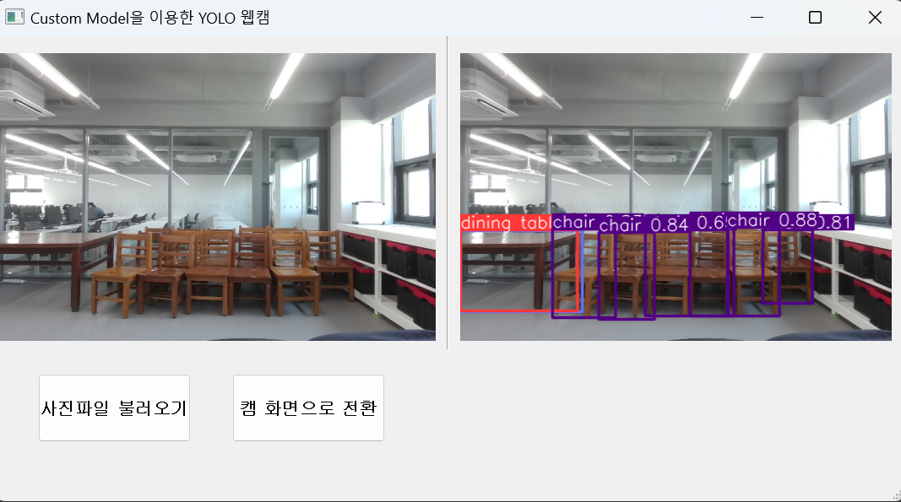
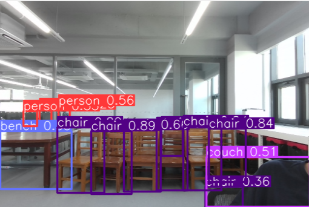
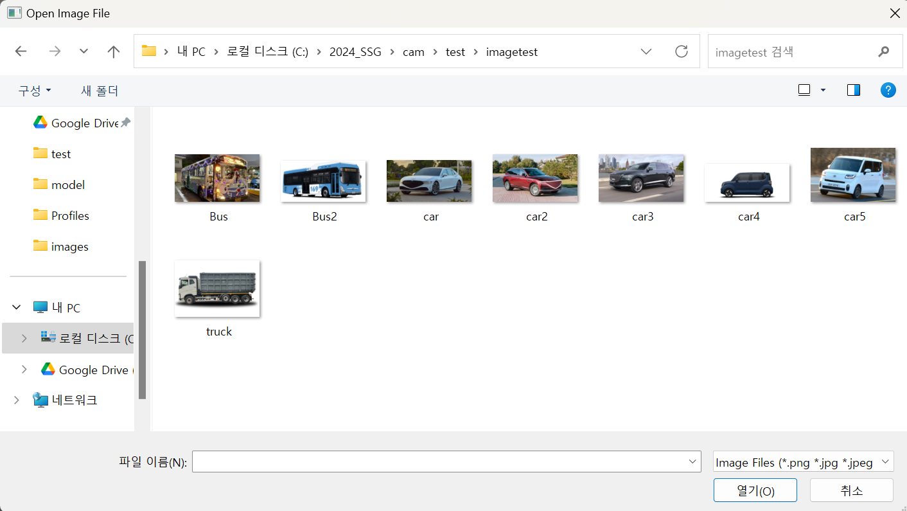
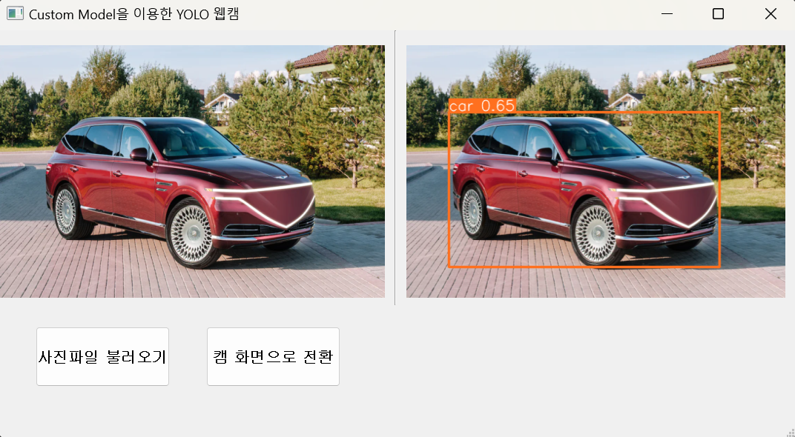
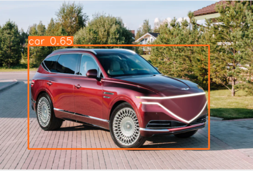
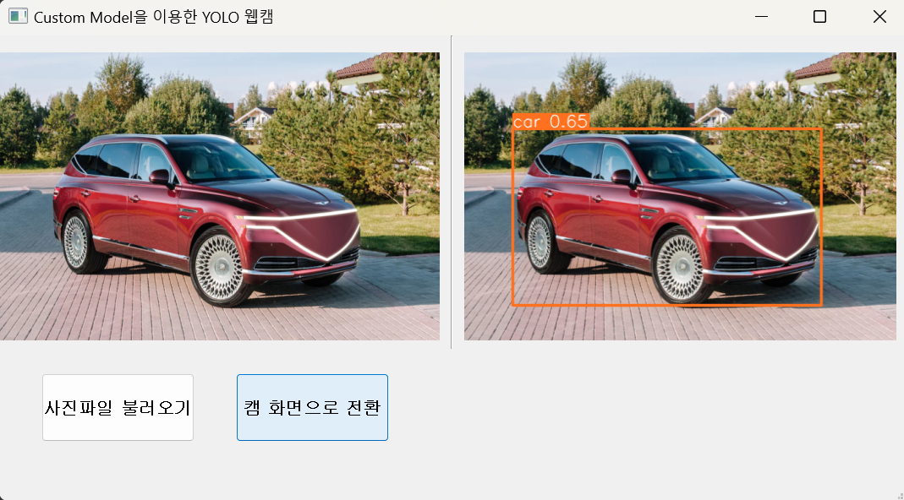

# Car_Object_Detection_Program

  <a href="https://github.com/SongSeungGun/Car_Object_Detection_Program/blob/main/cam.py"> 실행파일 </a>  

1. 웹캠을 열어서 실시간으로 객체를 탐지   

 

2. 객체를 감지한 클래스를 출력 결과창에 감지된 객체와 객체 클래스명 출력

 

3. 좌측 하단에 있는 사진파일 불러오기 클릭 시 -> 데스크탑에 저장된 이미지 파일 호출

 

4.호출된 이미지 파일이 입력 창에 전달 -> 입릭창에 전달된 이미지 파일 안에 있는 객체를 감지

 

5. 이미지 파일 안에서 감지된 객체를 출력창에 전송해서 감지된 객체의 위치와 크기, 클래스 이름을 표시

 

6. 이미지 파일에서 캠 화면으로 전환하고 싶을땐 사진불러오기 버튼 옆 캠 화면으로 전환 버튼 클릭

 

